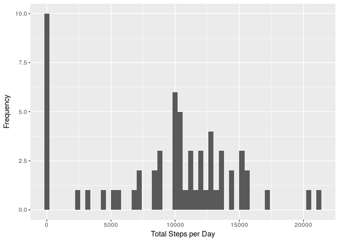
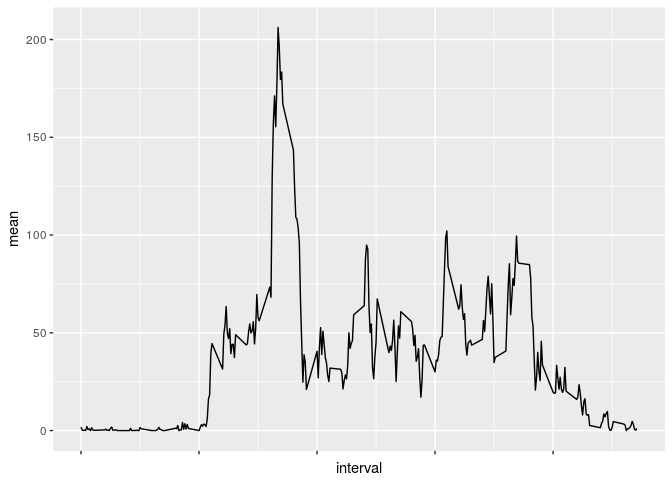
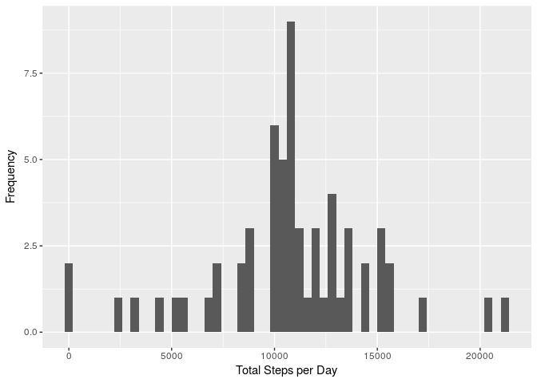
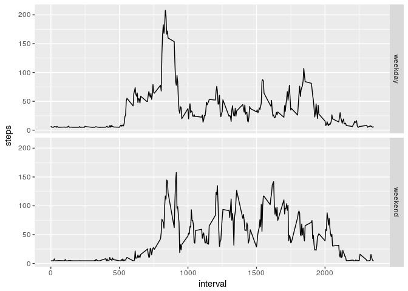

# Reproducible Research: Peer Assessment 1

This is the first Peer Assessment of the Reproducible Research course offered by Johns Hopkins University through Coursera. We will be looking at data collected from activity monitoring devices such as Fitbit, Nike Fuelband, and Jawbone Up. For more information on the course, visit [Reproducible Research](https://www.coursera.org/learn/reproducible-research)

## Loading and preprocessing the data
First we need to read and preprocess the data into a dataframe with proper date variables.


```r
library('lubridate')
unzip('activity.zip')
activity <- read.csv('activity.csv')
activity <- transform(activity, date=ymd(date))
head(activity)
```

```
##   steps       date interval
## 1    NA 2012-10-01        0
## 2    NA 2012-10-01        5
## 3    NA 2012-10-01       10
## 4    NA 2012-10-01       15
## 5    NA 2012-10-01       20
## 6    NA 2012-10-01       25
```


## What is mean total number of steps taken per day?
First, let's visualize the total number of steps taken each day using a histogram.


```r
library('ggplot2')
sum_by_day <- tapply(activity$steps, activity$date, sum, na.rm=TRUE)
qplot(sum_by_day, binwidth=400) + xlab('Total Steps per Day') +
  ylab('Frequency')
```

<!-- -->

We can also find the mean and median number of steps per day.


```r
mean(sum_by_day, na.rm=TRUE)
```

```
## [1] 9354.23
```

```r
median(sum_by_day, na.rm=TRUE)
```

```
## [1] 10395
```


## What is the average daily activity pattern?
We'd also like to discover the average distribution of activity over the course of a day. We can accomplish this by grouping and averaging across the interval column instead of the date column.


```r
mean_by_interval <- tapply(activity$steps, activity$interval, mean, na.rm=TRUE)
interval_col <-as.numeric(as.character(row.names(mean_by_interval)))
interval_df <- data.frame(interval_col, mean_by_interval, row.names=NULL)
names(interval_df) <- c('interval', 'mean')
ggplot(interval_df, aes(interval, mean, group=1)) + geom_line() +
  theme(axis.text.x=element_blank())
```

<!-- -->

We'd now like to identify the interval with the largest average number of steps. This turns out to be interval 08:35.


```r
interval_df[interval_df$mean == max(interval_df$mean), ]
```

```
##     interval     mean
## 104      835 206.1698
```

## Imputing missing values
Let's find out how many missing values there are in the dataset.


```r
summary(activity$steps)
```

```
##    Min. 1st Qu.  Median    Mean 3rd Qu.    Max.    NA's 
##    0.00    0.00    0.00   37.38   12.00  806.00    2304
```

There are 2304 NA's. We would like to fill in these missing values. We can do so by filling them in with the mean number of steps across the entire dataset.


```r
activity_imputed <- transform(activity, steps=ifelse(is.na(steps), mean(steps, na.rm=TRUE), steps))
```

Let's repeat the histogram from earlier, as well as the mean/median calculation.


```r
sum_by_day_imputed <- tapply(activity_imputed$steps, activity_imputed$date, sum, na.rm=TRUE)
qplot(sum_by_day_imputed, binwidth=400) + xlab('Total Steps per Day') +
  ylab('Frequency')
```

<!-- -->

```r
mean(sum_by_day_imputed)
```

```
## [1] 10766.19
```

```r
median(sum_by_day_imputed)
```

```
## [1] 10766.19
```

As we can see, this method of imputation seems to affect both the mean and median significantly by pushing it upward.

## Are there differences in activity patterns between weekdays and weekends?
Let's see how the activity pattern changes between weekdays and weekends.


```r
activity_imputed <- transform(activity_imputed, weekday=factor(ifelse(weekdays(date) %in% c('Saturday', 'Sunday'), 'weekend', 'weekday')))
mean_by_interval_imputed <- aggregate(data=activity_imputed, steps ~ interval + weekday, mean)
ggplot(mean_by_interval_imputed, aes(interval, steps)) + geom_line() + facet_grid(weekday ~ .)
```

<!-- -->

It looks as though this person tends to be more active on weekdays than weekends, or sometimes gets a late start on their workout.
